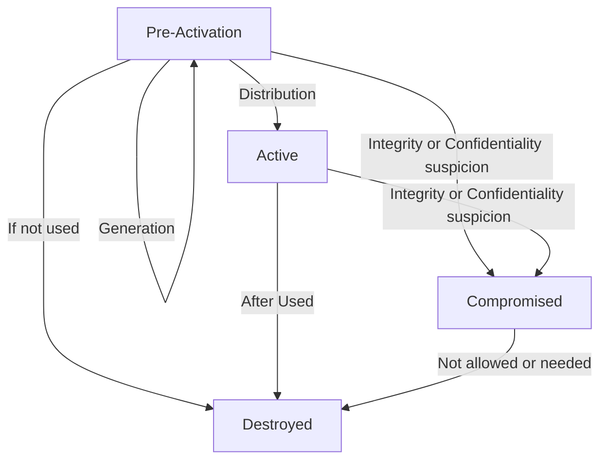
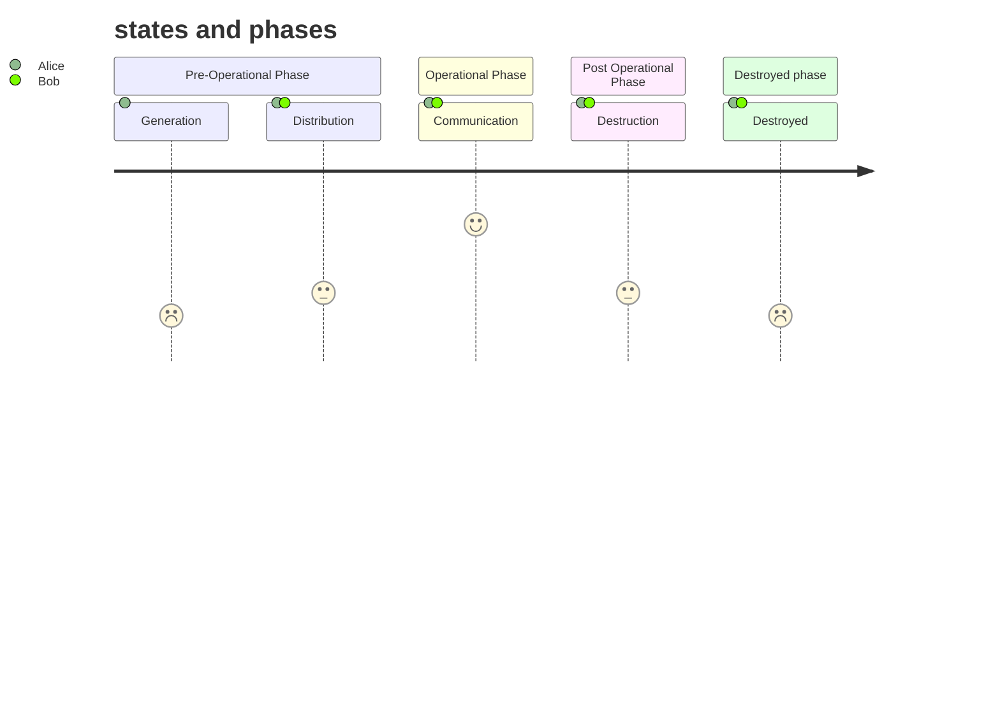
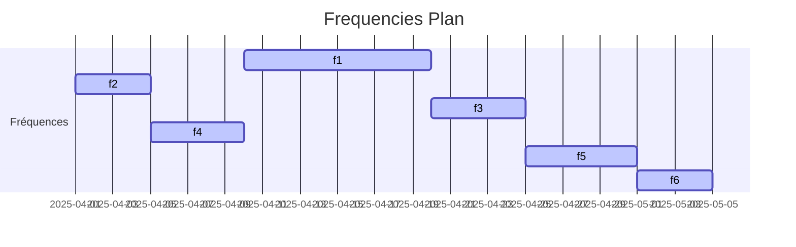

<p align="center">
    
</p>


[](https://www.gnu.org/licenses/gpl-3.0)
[](https://github.com/sponsors/Aif4thah/)

# SecCW

**When modern communication methods fail, Morse code (aka CW / OOK) can still be used effectively.** Its simplicity and low bandwidth requirements make it a robust fallback option. This is particularly relevant in situations where other forms of communication are disrupted or unavailable. for instance, morse code is still used by militaries around the world. It serves as a reliable backup when modern communication systems fail.

**Morse code does not inherently provide confidentiality by default**. It is a simple encoding method that can be easily intercepted and understood by anyone familiar with the code.

The purpose of this repository is **to provide some tools for transmitting and receiving sensitive informations** in Morse code.


> [!WARNING]
> This repository and its tools are provided "as is." The author(s) make no representations or warranties, express or implied, regarding the operation of the information, content, materials, tools, services, or products included. The author(s) disclaim, to the full extent permissible by law, all warranties, express or implied, including implied warranties of merchantability and fitness for a particular purpose.

> [!NOTE]
> While this project is open-source and free to use, we kindly ask that if you are using it for commercial purposes or in a business setting, please consider sponsoring the project through GitHub Sponsors. Your support helps maintain and improve the project, ensuring it remains a valuable resource for everyone. Thank you for your understanding and generosity.


## Proof Of Concept

### Transmit

Generate Key, IVs and encrypt : 

```sh
python ./MsgToCypher.py test

# key: 9CEA372979FFDCBA028BD523A3F43A44B527DE31E2BBAE56F641D87D3F6C80BC
# iv: A977EA111934D65E8A6B5AC3D52B82F8
# cipherText: EFAADCF7EA0A786EF7B4EF7504605970
# next iv : 1DAA7C45D2D1D68B934BC3E71F2D6CAC
# next iv : 6DEBDB4819F6639AC7288EE2DBE7C901
# next iv : F9A5240967B6C3AD88CB7E9A04434822
# next iv : F2427CAF0E5EF2F65B9A2AA4D8E43F79
```

> [!IMPORTANT]  
> Unlike key, IVs must not be used more than once. Generate as many IVs as messages.

You can also specify Key and IV : 

```sh
python ./MsgToCypher.py enc test 9CEA372979FFDCBA028BD523A3F43A44B527DE31E2BBAE56F641D87D3F6C80BC A977EA111934D65E8A6B5AC3D52B82F8

# key: 9CEA372979FFDCBA028BD523A3F43A44B527DE31E2BBAE56F641D87D3F6C80BC
# iv: A977EA111934D65E8A6B5AC3D52B82F8
# cipherText: EFAADCF7EA0A786EF7B4EF7504605970
```

Convert to CW and write an IQ file :

```sh
python ./CWToCS8.py EFAADCF7EA0A786EF7B4EF7504605970 test-to-transmit.cs8
```

verify real part before sending :

```sh
python ./ReadCS8.py test-to-transmit.cs8
```


get wavelength from your choosen frequency :

```sh
python .\FreqToAntSize.py <freq>

#λ (m) : 7.370073
#Ant (cm) : 184.251824
```

Transmit with SDR (adjust LNA and VGA) :

```sh
hackrf_transfer -s 8000000 -x 47 -g 60 -l 40 -a 1 -f <freq> -b 1750000 -t .\test-to-transmit.cs8
```


### Receive

> [!TIP]
> The easy way to receive is to use a radio receiver, a third party tool such as SDR#, or a simple Talkie Walkie.


For further analysis, here is the `HackRF_transfer` command to write the signal in an IQ file (adjust LNA and VGA) :

```sh
hackrf_transfer -s 8000000 -f <freq> -b 1750000 -a 1 -l 24 -g 12 -r test-recvd.cs8
```

Then we can visualize the Signal :

```sh
python ./ReadCS8.py .\test-recvd.cs8
```

FFT :


Amplitude over time :


Decrypt :

```sh
python ./MsgToCypher.py dec EFAADCF7EA0A786EF7B4EF7504605970 9CEA372979FFDCBA028BD523A3F43A44B527DE31E2BBAE56F641D87D3F6C80BC A977EA111934D65E8A6B5AC3D52B82F8

# message: test
```

## Other consideration

### Amplification

To leverage this proof of concept, I suggest using an external LNA as RF amplifier to gain a small amount of power

> [!WARNING]
> Using an LNA or other external amplifiers can damage your SDR. Always use a DC blocker.

> [!WARNING]
> Check compliance with local regulations.

### Cryptography

**crpyptagraphic keys management is a big deal**. this POC just simplify the [NIST.SP.800-57](https://csrc.nist.gov/pubs/sp/800/57/pt1/r5/final) Key States :

| States | Short Description |
|-----|-----|
| Pre-activation | Key has been generated but has not been authorized for use |
| Active | Key may be used to cryptographically protect information |
| Compromised | Compromised key shall not be used to apply cryptographic protection to information |
| Destroyed  | Key cannot be recovered by either physical or electronic means |

Simplified Key Management Phases and Functions :



Simplified key management states and phases :




### Frequencies

Obfuscation is not security, but to avoid interception you can change frequency over time.




## Environment

### Python

* version: 3.13.2.
* Virtual Env and dependencies: read `requirement.txt`

### HackRF-One

* Binaries: 2024.02.1
* Firmware Version: 2024.02.1

## Credits

* Special thanks to @jboone [for his original Morse script](https://gist.github.com/jboone/de67df55a2059dcebcdb).
