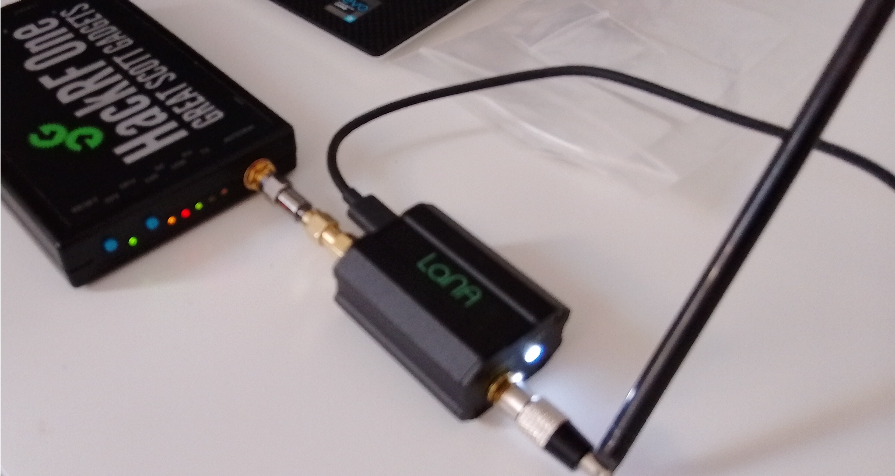
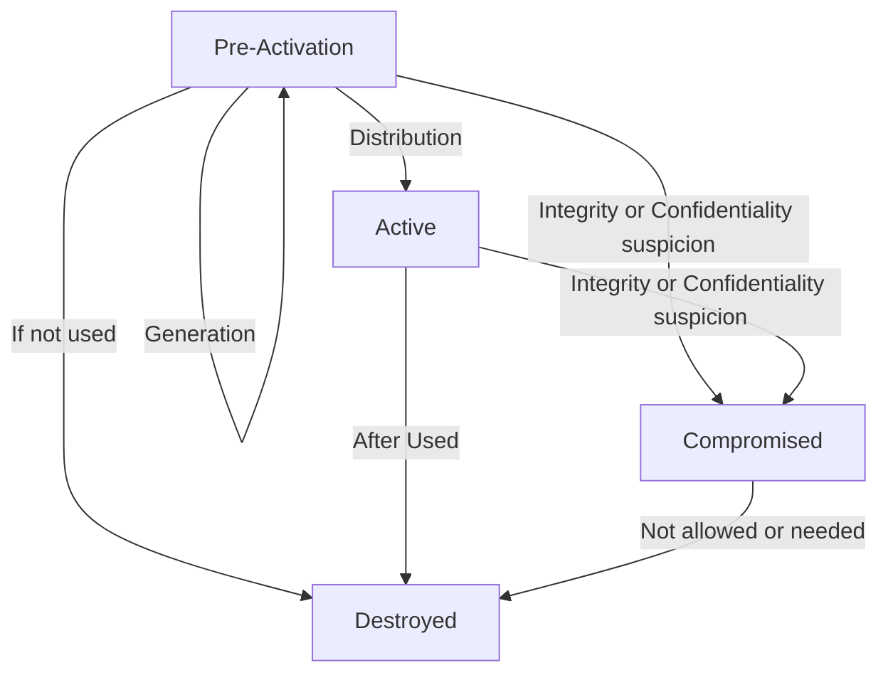
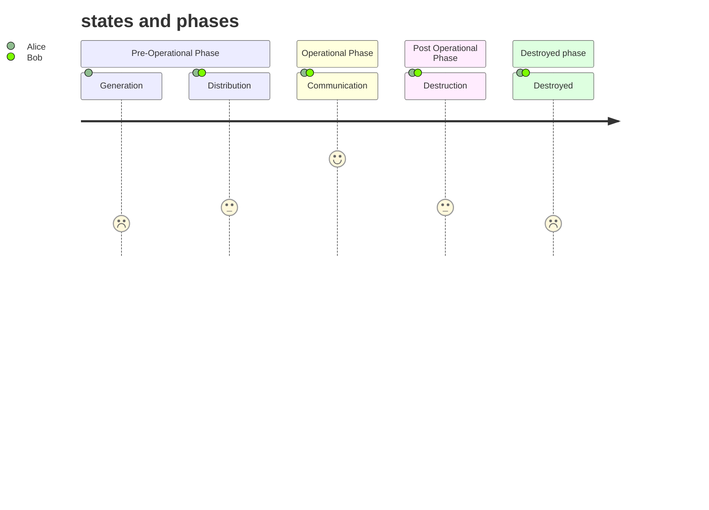
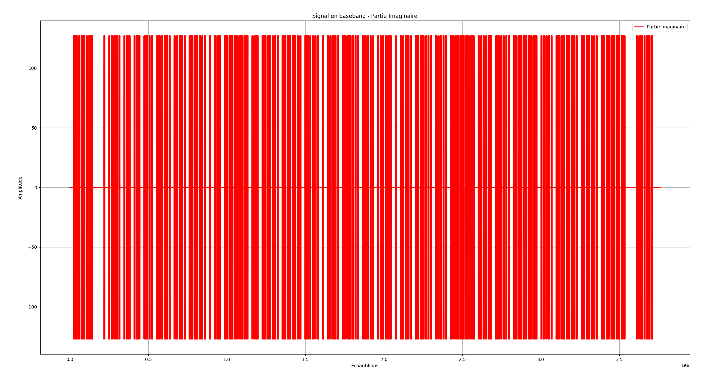

<p align="center">
    
</p>


[](https://www.gnu.org/licenses/gpl-3.0)
[](https://github.com/sponsors/Aif4thah/)

# SecCW

Secured Continuous Wave transmission

> [!CAUTION]
> This is a non-standardized POC. Use it at your own risk.

> [!WARNING]
> This repository and its tools are provided "as is." The author(s) make no representations or warranties, express or implied, regarding the operation of the information, content, materials, tools, services, or products included. The author(s) disclaim, to the full extent permissible by law, all warranties, express or implied, including implied warranties of merchantability and fitness for a particular purpose.

> [!NOTE]
> While this project is open-source and free to use, we kindly ask that if you are using it for commercial purposes or in a business setting, please consider sponsoring the project through GitHub Sponsors. Your support helps maintain and improve the project, ensuring it remains a valuable resource for everyone. Thank you for your understanding and generosity.


## Proof Of Concept

### Amplification

* To leverage this proof of concept, I suggest using an external LNA as RF amplifier to gain a small amount of power (less than **0.5W to ensure compliance with local regulations.**)

### Cryptographic concerns

* **crpyptagraphic keys management is a big deal** that the POC do not describes. 

We just simplify the [NIST.SP.800-57](https://csrc.nist.gov/pubs/sp/800/57/pt1/r5/final) Key States :


| States | Short Description |
|-----|-----|
| Pre-activation | Key has been generated but has not been authorized for use |
| Active | Key may be used to cryptographically protect information |
| Compromised | Compromised key shall not be used to apply cryptographic protection to information |
| Destroyed  | Key cannot be recovered by either physical or electronic means |

Simplified Key Management Phases and Functions ;


```mermaid
flowchart TD
    P[Pre-Activation]
    A[Active]
    D[Destroyed]
    C[Compromised]

    P --> | Generation | P
    P --> | If not used | D
    P --> | Integrity or Confidentiality suspicion | C
    P --> | Distribution| A
    A --> | After Used | D
    A --> | Integrity or Confidentiality suspicion | C
    C --> | Not allowed or needed | D
```

Simplified key management states and phases :


```mermaid
journey
    title states and phases
    section Pre-Operational Phase
      Generation: 2: Alice
      Distribution: 3: Alice, Bob
    section Operational Phase
      Communication: 6: Alice, Bob
    section Post Operational Phase
      Destruction: 3: Alice,Bob
    section Destroyed phase
      Destroyed: 2: Alice,Bob
```


### Transmit

```sh
python ./MsgToCypher.py enc test 9CEA372979FFDCBA028BD523A3F43A44B527DE31E2BBAE56F641D87D3F6C80BC A977EA111934D65E8A6B5AC3D52B82F8
key: 9CEA372979FFDCBA028BD523A3F43A44B527DE31E2BBAE56F641D87D3F6C80BC
iv: A977EA111934D65E8A6B5AC3D52B82F8

# cipher: EFAADCF7EA0A786EF7B4EF7504605970
```


```sh
python ./CWToCS8.py EFAADCF7EA0A786EF7B4EF7504605970 test.cs8
```


```sh
hackrf_transfer -s 8000000 -x 16 -a 1 -f 40677000 -b 1750000 -t test.cs8
```


### Recieve

* Receive with HackRF or another material like a Talkie-Walkie and Decode Morse

```pyhton
python ./ReadCS8.py ./test.cs8
```




* Decrypt

```sh
python ./MsgToCypher.py dec EFAADCF7EA0A786EF7B4EF7504605970 9CEA372979FFDCBA028BD523A3F43A44B527DE31E2BBAE56F641D87D3F6C80BC A977EA111934D65E8A6B5AC3D52B82F8

# message: test
```


### Environment

### Python

* version: 3.13.2.
* Virtual Env: read `requirement.txt`

### HackRF-One

* Binaries: 2024.02.1
* Firmware Version: 2024.02.1

## Go further...

* Read Scripts

* More info about DSP and RF on [Dojo-101](https://github.com/Aif4thah/Dojo-101)

## Credits

* Special thanks to Jared Boone (ShareBrained Technology) for his original script, without him the development would have been much longer !