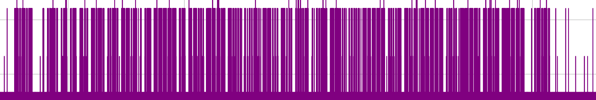

<p align="center">
    
</p>


[](https://www.gnu.org/licenses/gpl-3.0)
[](https://github.com/sponsors/Aif4thah/)

# SecCW

**When modern communication methods fail, Morse code is still a robust fallback option. However it does not provide confidentiality. The purpose of this repository is to provide some tools for transmitting and receiving sensitive informations.**

> [!CAUTION]
> Please keep in mind that this is a Proof of concept. Take the time to read the readme and all the warnings. It's your responsibility to stay within the law and use your material correctly.

> [!WARNING]
> This repository and its tools are provided "as is." The author(s) make no representations or warranties, express or implied, regarding the operation of the information, content, materials, tools, services, or products included. The author(s) disclaim, to the full extent permissible by law, all warranties, express or implied, including implied warranties of merchantability and fitness for a particular purpose.

> [!NOTE]
> While this project is open-source and free to use, we kindly ask that if you are using it for commercial purposes or in a business setting, please consider sponsoring the project through GitHub Sponsors. Your support helps maintain and improve the project, ensuring it remains a valuable resource for everyone. Thank you for your understanding and generosity.


## 1. Preparation

### 1.1 Understand cryptographic concepts

To communicate securely, you need to generate and share cryptographic secrets :


This POC simplify the [NIST.SP.800-57](https://csrc.nist.gov/pubs/sp/800/57/pt1/r5/final) `Key States` :


| States | Short Description |
|-----|-----|
| Pre-activation | Key has been generated but has not been authorized for use |
| Active | Key may be used to cryptographically protect information |
| Compromised | Compromised key shall not be used to apply cryptographic protection to information |
| Destroyed  | Key cannot be recovered by either physical or electronic means |

Keep in mind the `Key Management` Phases and Functions :


> [!IMPORTANT]  
> This phase is the most important: if the secret leaks out, confidentiality is lost.

### 1.2 Generate keys and IVs

This exemple use the `AES256` algorithm :

```sh
python ./MsgToCypher.py test

# key: 9CEA372979FFDCBA028BD523A3F43A44B527DE31E2BBAE56F641D87D3F6C80BC
# iv: A977EA111934D65E8A6B5AC3D52B82F8
# cipherText: EFAADCF7EA0A786EF7B4EF7504605970
# next iv : 1DAA7C45D2D1D68B934BC3E71F2D6CAC
# next iv : 6DEBDB4819F6639AC7288EE2DBE7C901
# next iv : F9A5240967B6C3AD88CB7E9A04434822
# next iv : F2427CAF0E5EF2F65B9A2AA4D8E43F79
```

> [!IMPORTANT]  
> Unlike key, IVs must not be used more than once. Generate as many IVs as messages.

Then share your secret with your recipients over a secure channel.


### 1.3 Choose a frequency plan

Obfuscation is not security, but to avoid interception you can change frequency over time.


> [!IMPORTANT]  
> The more you change frequencies, the more your audience may miss your message, so be sure to use the same time source.

When frequency changes, antenna type and recommended length vary, get wavelength from your choosen frequency :

```sh
python .\FreqToAntSize.py <freq_hz>

#λ (m) : X.XXXX
#Ant (cm) : YYY.YYYY
```

Share your frequency plan with your recipients over a secure channel.

> [!WARNING]
> It is not legal to transmit at any power on any frequency. Find out about current regulations before validating your frequency plan.


## 2. Transmit

### 2.1 Encrypt your message

This exemple encrypt de message "test" :

```sh
python ./MsgToCypher.py enc test 9CEA372979FFDCBA028BD523A3F43A44B527DE31E2BBAE56F641D87D3F6C80BC A977EA111934D65E8A6B5AC3D52B82F8

# key: 9CEA372979FFDCBA028BD523A3F43A44B527DE31E2BBAE56F641D87D3F6C80BC
# iv: A977EA111934D65E8A6B5AC3D52B82F8
# cipherText: EFAADCF7EA0A786EF7B4EF7504605970
```

> [!TIP]
> AES encryption works whith blocks, so don't make it too long or too short.

### 2.2 Write Signal into a file

Convert to CW and write an IQ file :

```sh
python ./CWToCS8.py EFAADCF7EA0A786EF7B4EF7504605970 test-to-transmit.cs8
```

Verify real part before sending :

```sh
python ./ReadCS8.py test-to-transmit.cs8
```


### 2.3 Send it

To exploit this proof of concept, I suggest, if the law permits, using an external LNA as an RF amplifier to gain a small amount of power.

> [!WARNING]
> It is not legal to transmit at any power on any frequency. Find out about current regulations before use a RF amplifier.

> [!CAUTION]
> Using an LNA or other external amplifiers can damage your SDR. Always use a DC blocker.

Transmit with SDR (adjust LNA, VGA) :

```sh
hackrf_transfer -s 8000000 -x 47 -g 60 -l 40 -a 1 -f <freq_hz> -b 1750000 -t .\test-to-transmit.cs8
```


## 3. Receive

> [!TIP]
> The easy way to receive is to use a radio receiver, a third party tool such as SDR#, or a simple Talkie Walkie.

### 3.1 Receive and Decode cypher-text

You can simply listen to or read the waterfall :


For further analysis, here is the `HackRF_transfer` command to write the signal in an IQ file (adjust LNA and VGA) :

```sh
hackrf_transfer -s 8000000 -f <freq_hz> -b 1750000 -a 1 -l 24 -g 12 -r test-recvd.cs8
```

Then we can visualize the Signal :

```sh
python ./ReadCS8.py .\test-recvd.cs8
```


FFT :


Amplitude over time :



### 3.2 Get the Clear Text

After decoding the Morse code, decrypt the message

```sh
python ./MsgToCypher.py dec EFAADCF7EA0A786EF7B4EF7504605970 9CEA372979FFDCBA028BD523A3F43A44B527DE31E2BBAE56F641D87D3F6C80BC A977EA111934D65E8A6B5AC3D52B82F8

# message: test
```


## 4. Misc

### Environment

 Python

* version: 3.13.2.
* Virtual Env and dependencies: read `requirement.txt`

HackRF-One

* Binaries: 2024.02.1
* Firmware Version: 2024.02.1

## 5. Credits

* Special thanks to @jboone [for his original Morse script](https://gist.github.com/jboone/de67df55a2059dcebcdb).
