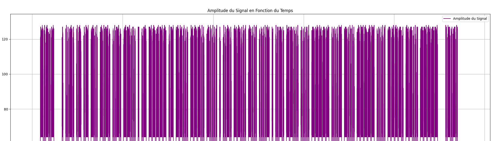

<p align="center">
    
    When modern communication methods fail, Morse code is still a robust fallback option. However it does not provide confidentiality.
    The purpose of this repository is to provide some tools for transmitting and receiving sensitive informations. It can be adapted to any radio equipment.

</p>

# SecCW

[](https://www.gnu.org/licenses/gpl-3.0)
[](https://github.com/sponsors/Aif4thah/)

> [!WARNING]
> This repository and its tools are provided "as is" without warranty of any kind, either express or implied, including but not limited to, any warranties of merchantability, fitness for a particular purpose, and non-infringement. The authors shall not be liable for any claims, damages, or other liabilities arising from, out of, or in connection with the use of this tool. The user is solely responsible for ensuring their use of this tool complies with all applicable laws and regulations. The authors disclaim any liability for illegal or unethical use.

## Inventory

| **Script**        | **Use Case**                                      |
|-------------------|---------------------------------------------------|
| `MsgToCypher.py`  | AES256 secret generation, Message encryption/decryption |
| `CWToCS8.py`      | Convert message to IQ, write CS8 file             |
| `ReadCS8.py`      | Display Signal (IQ, FFT, Amp) from a CS8 file    |
| `FreqToAntSize.py`| Convert Frequency to Wavelength                   |

## POC

### Cryptographic concepts

To communicate securely, you need to generate and share cryptographic secrets :


This POC simplify the [NIST.SP.800-57](https://csrc.nist.gov/pubs/sp/800/57/pt1/r5/final) `Key States` :

| States | Short Description |
|-----|-----|
| Pre-activation | Key has been generated but has not been authorized for use |
| Active | Key may be used to cryptographically protect information |
| Compromised | Compromised key shall not be used to apply cryptographic protection to information |
| Destroyed  | Key cannot be recovered by either physical or electronic means |

Keep in mind the `Key Management` Phases and Functions :


### Secrets Generation

This example generates the `AES256` key and the `IV` (initialization vectors) for your future messages.

```sh
python ./MsgToCypher.py test

# key: 9CEA372979FFDCBA028BD523A3F43A44B527DE31E2BBAE56F641D87D3F6C80BC
# iv: A977EA111934D65E8A6B5AC3D52B82F8
# cipherText: EFAADCF7EA0A786EF7B4EF7504605970
# next iv : 1DAA7C45D2D1D68B934BC3E71F2D6CAC
# next iv : 6DEBDB4819F6639AC7288EE2DBE7C901
# next iv : F9A5240967B6C3AD88CB7E9A04434822
# next iv : F2427CAF0E5EF2F65B9A2AA4D8E43F79
```

### Frequency plan

Obfuscation is not security, but to mitigate the risk of interception you can change frequency over time.


When frequency changes, antenna type and recommended length vary :

```sh
python .\FreqToAntSize.py <freq_hz>

#λ (m) : X.XXXX
#Ant (cm) : YYY.YYYY
```

### Encryption

This exemple encrypt de message "test" using the `AES256` algorithm with `CBC` mode :

```sh
python ./MsgToCypher.py enc test 9CEA372979FFDCBA028BD523A3F43A44B527DE31E2BBAE56F641D87D3F6C80BC A977EA111934D65E8A6B5AC3D52B82F8

# key: 9CEA372979FFDCBA028BD523A3F43A44B527DE31E2BBAE56F641D87D3F6C80BC
# iv: A977EA111934D65E8A6B5AC3D52B82F8
# cipherText: EFAADCF7EA0A786EF7B4EF7504605970
```

### Signal Processing

Convert to CW and write an IQ file, specify `AM` or `FM` modulation to make Morse code audible :

```sh
python ./CWToCS8.py EFAADCF7EA0A786EF7B4EF7504605970 test-to-transmit.cs8 AM
python ./ReadCS8.py test-to-transmit.cs8
```




### Transmit

Transmit with `HackRF_transfer` (adjust LNA, VGA, AMP, frequence, fileName etc.) :

```sh
 hackrf_transfer -s 8000000 -x 47 -g 60 -l 40 -a 1 -f 26975000 -b 1750000 -t .\test-to-transmit.cs8
```

### Receive

You can simply listen to or read the waterfall :


For further analysis, here is the `HackRF_transfer` command to write the signal in an IQ file (adjust LNA and VGA) and visualize it :

```sh
hackrf_transfer -s 8000000 -f <freq_hz> -b 1750000 -a 1 -l 24 -g 12 -r test-recvd.cs8
python ./ReadCS8.py .\test-recvd.cs8
```


### Decryption

```sh
python ./MsgToCypher.py dec EFAADCF7EA0A786EF7B4EF7504605970 9CEA372979FFDCBA028BD523A3F43A44B527DE31E2BBAE56F641D87D3F6C80BC A977EA111934D65E8A6B5AC3D52B82F8

# message: test
```

## Misc

### Python

* version: 3.13.2.
* Virtual Env and dependencies: read `requirement.txt`

### HackRF-One

* Binaries: 2024.02.1
* Firmware Version: 2024.02.1

## Credits

* Special thanks to @jboone [for his original Morse script](https://gist.github.com/jboone/de67df55a2059dcebcdb).

* Support this effort and give back by [sponsoring on GitHub!](https://github.com/sponsors/Aif4thah/)
